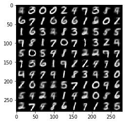
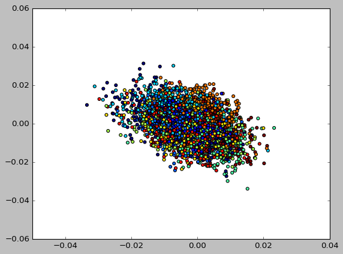
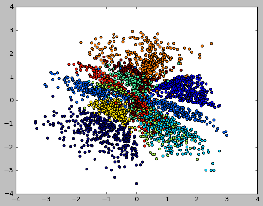

# Pytorch Implementation of MMD Variational Autoencoder
-----------------------------------------------------------------------------------------------------------------------------
Implementation of the paper [InfoVAE: Information Maximizing Variational Autoencoders](https://arxiv.org/abs/1706.02262)

The Code has been converted from the TensorFlow [implementation](https://github.com/ShengjiaZhao/MMD-Variational-Autoencoder) by [Shengjia Zhao](https://github.com/ShengjiaZhao)

The results shown are generated by the given pytorch code.

"Details and motivation are described in this [paper](https://arxiv.org/abs/1706.02262) or [tutorial](http://szhao.me/2017/06/10/a-tutorial-on-mmd-variational-autoencoders.html)"

Sample generated after 27 epochs of training on MNIST

Scatter Plot on the distribution of labels in the feature space (for 2 dimensional z)

## Before Training

## After Training

